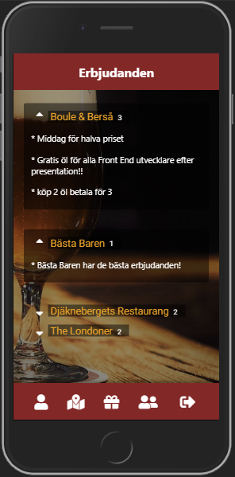
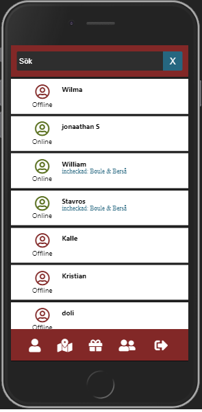
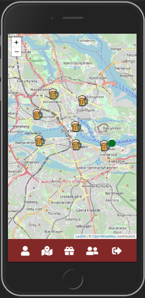
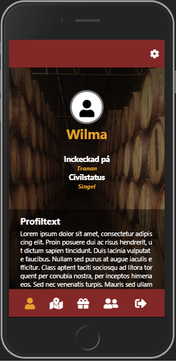
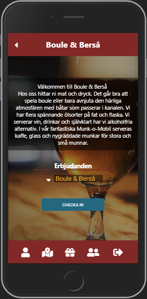

Beerhunter is a GPS  based app created from four students at KYH Front end Developer School in Stockholm. We wanted to build a platform for students where they can take part of customized offers/events from different bars in Stockholm. The fundamental idea with the app was also to facilitate for students to go out in groups and have the bars compete for the groups with offers. Groups with many students will be more attractive for the bars and the best offer will win over the students.

Beerhunter became also a great digital framework for bars to communicate with a customer. The work many bars does today with physical marketing such as flyers and etc can now be done digital online over Beerhunter instead.  

The requirement for the project was the following: 
* Based on GPS. 
* Implement real-time data between the user. Such as chats or offers.
* Have a benefit to users - preferably something that other systems/platforms do not already offer.
* Mobile interface for users and Desktop interface for Admins.  
* Customized for Chrome (desktop + mobil), FireFox, Safari (desktop + mobile).
* Responsive code. 
* Developed with React 
* Use Firebase for a backend. 
* Use style Component for styling. 

Functionality.

*Users can check in to bars to see other users that are checked in and to see current offers made from the bar. 
*Users can edit their profile after signing up. Such as name, Bio text, relationship status.
*Users can see an overview with all offers that have been made from all bars. 
*Users can see an overview with all user that has signed up, and can easily see where they are checked in and if they are online or not. 
*Users can click on other users to find more information about that person. 

*Admin can edit their profile after signing up. Such as name, Bar text.
*Admin can create and delete offers. 

Link to trello: 
https://trello.com/b/FeCc6rzz/project-grex

Link to BurnDown:
https://docs.google.com/spreadsheets/d/148EpY6KWGWgSCcKmoyqd_BovGc4mJ-R1EBp5ILXPFqg/edit#gid=881789985

Created by: 
William Nordqvist,
Jonathan Silkewall, 
Stavros Tsirlidis,
Fredrik Dahlström,

Students at KYH Stockholm Front end developer. 
https://kyh.se/utbildningar/front-end-developer/
